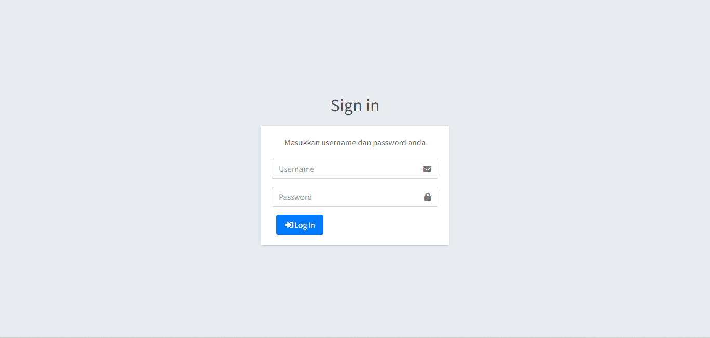

# Aplikasi Laundry berbasis Web
Aplikasi ini dibangun menggunakan PHP versi 7 dengan framework CodeIgniter 3, dan Maria DB.
___

## Tampilan Aplikasi
 // Halaman Lending Page
 // Halaman Registerasi
 // Halaman Login
 // Halaman Dashboard
 // Halaman Data Outlet
 // Halaman Data Paket
 // Halaman Data Member
 // Halaman Data User
 // Halaman Tambah Transaksi
 // Halaman Riwayat Transaksi
 // Halaman Data Laporan

___

## Fitur-fitur:
- Login
- Logout
- Registrasi Pelanggan
- CRUD Outlet
- CRUD produk/paket cucian
- CRUD pengguna
- Entri transaksi
- Generate laporan
___

## Akun:
Jabatan akun dibagi menjadi 3 yaitu: administrator, kasir, dan owner.
Untuk mengakses akun, pada bagian akhir url bisa ditambahkan auth/. misal: http://localhost/ukkmiaa2/
|    Level              |       Username      | Password |
|:---------------------:|:-------------------:|:--------:|
| Administrator         | admin               |  admin   |
| Kasir                 | kasir               |  kasir   |
| Owner                 | owner               |  owner   |

1. Administrator dapat mengakses semua fitur yang ada
2. Kasir hanya dapat mengakses data tambah transaksi dan data riwayat transkasi
3. Owner hanya dapat mengakses data laporan
___

## Database
database terdapat dalam folder databases. nama database nya adalah ukkmiaa2
___